# Winning Baseball Games in the RMAC
Final Project for Regis University Data Science Practicum II - Spring 2019

The Rocky Mountain Athletic Conference is an NCAA division II athletic conference with team located in various states in the Rocky Mountain region. The conference has had anywhere from eight to ten baseball teams since 2004 with all teams having the same goal: win baseball games. As the leader of the team, the head coach must make decisions that will lead to the team to victory in games with many of these decisions surrounding what the team will work on during practice, and what kind of player will be recruited to join the team in years to come. As such, it would be helpful for a coach to know which aspects of a baseball game most contribute to the outcome of a win. Overall, there are three aspects of the game, batting, fielding, and pitching. Within each of these three broad categories are subcategories that measure statistics such as batting average or earned run average. If a coach were to know which of these categories most contributed to teams winning baseball games within their respective conferences, then the coach would be able to tailor practices to work on these specific aspects of the game, and also know which type of player needs to be recruited for the future. This goal of this project is to uncover which statistical categories most contribute to winning baseball games in the RMAC so that the coaches of the Regis University baseball team may be able to use the information to supplement future decisions. 

## Data Collection and Cleaning

The RMAC baseball archives keep statistics that date back to the 2004 season. I collected all team statistics available on the RMAC website from years 2004-2018. The team statistics were divided into three categories that included “overall statistics”, “pitching statistics”, and “fielding statistics”. The “pitching statistics” category and the “fielding statistics” category contained unique measures, however the “overall statistics” category did contain some repeat statistics. I downloaded all the data sets from the RMAC website and loaded them into excel spreadsheets. I was able to use the “text-to-columns” function in excel to get the data into the proper format in excel, and then converted my excel worksheet into a csv file. 
Most of the cleaning that was necessary for this project was done in excel. The cleaning in excel included combining the yearly data into a single worksheet and then ensuring that the formatting of the single combined spreadsheet was acceptable for use. Once cleaning in excel was complete, I saved the worksheet as a csv file and uploaded it into Rstudio to begin work on the data. In total, the data set is comprised of 123 rows of 56 variables(columns) for a total of 6,888 total observations. All variables expect one are numeric. One of the variables is also the dependent variable that I will be attempting to predict. This leaves 53 variables that will be used for prediction. The acronyms for the variables and various teams in the RMAC in the data are as follows:

## Teams
       ASU: Adams State University
       CCU: Colorado Christian University
       CMU: Colorado Mesa University
       CSM: Colorado School of Mines
       CSUP: Colorado State University - Pueblo
       FHSU: Fort Hays State University
       MSUD: Metropolitan State Unviersity of Denver
       NMHU: New Mexico Highlands University
       Regis: Regis University
       UNK: University of Nebraska - Kearney

## Batting Statistics

       AVG: Batting Average
       G: Games Played
       AB: At-bats
       R: Runs scored
       H: Hits
       DOUBLES (originally 2B): Doubles
       TRIPLES (originally 3B): Triples
       HR: Homeruns
       RBI: Runs Batted In
       TB: Total Bases
       SLGperc: Slugging Percentage
       BB: Base on Balls (Walks)
       HBP: Hit by Pitch
       SO: Strikeouts
       GDP: Ground Ball Doubles Plays Hit Into
       Obperc: On-base percentage
       SF: Sacrifice Flies
       SH: Sacrifice Hits
       SBB: Stolen Bases
       ATT: Stolen Base Attempts
       SBB-ATTperc : Stolen Base percentage

## Pitching Statistics

       ERA: Earned Run Average
       W: Team Wins
       CG: Complete Games
       SHO: Shutouts
       CBO: Complete Game Shutouts
       SV: Saves
       IP: Innings Pitched
       Hallowed: Hits allowed
       Rallowed: Runs allowed
       ER: Earned Runs
       BBallowed: Walks allowed
       SOfor: Number of strikeouts thrown
       DOUBLESAllowed: Doubles Allowed
       TRIPLESAllowed: Triples Allowed
       HRAllowed: Home Runs Allowed
       ABagainst: At-bats against
       AVGagainst: Batting average against
       WP: Wild Pitches
       HBPpithcing: Number of batters hit by a pitch
       BK: Balks
       SFA: Sacrifice Flies Against
       SHA: Sacrifice Hits Against

## Fielding Statistics

       C: Chances
       PO: Put-outs
       A: Assists
       E: Errors
       FLDperc: Fielding Percentage
       DPs: Double Plays Turned
       SBA: Stolen Bases Allowed
       CSB: Caught Stealing By (pitcher and catcher)
       SBAperc: Stolen Bases Allowed percentage
       PB: Passed Balls
       CI: Catcher’s Interference

The RMAC was somewhat inconsistent in the format they used to upload data to their website as well as in the statistics that they chose to include in their data sets. For the years 2017 and 2018, several statistical categories were not included in the data, and thus were returned as missing values in my data set. Missing data returns an error message when attempting to implement certain algorithms in R, so I decided to do some imputation to make the data set complete. Using the MICE package in R, I was able to perform Predictive Mean Matching (PMM) to impute the missing values. In total, there were 288 missing variables that I replaced with imputed values. It is not ideal to impute missing values, especially in a predictive problem such as this one. However, by using the MICE package and PMM, I hoped to impute the most accurate predictions I possibly can in the data. 

## EDA

Since I have been around baseball my whole life, I felt as though I had a pretty good understanding of what this data was like prior to performing EDA. Nevertheless, it always helps to get some baseline statistics as well as visualize some of that data that one will be working with. As such, I began by dividing the large data set into three smaller data sets based on which category of statistics each individual statistic belonged to. Thus, I ended up with three smaller data sets pertaining to the categories of batting, fielding, and pitching statistics. The summary of each of these three data sets can be seen below. 

## Batting Statistics Summary
               W              AVG               G               AB      
       Min.   : 3.00   Min.   :0.2560   Min.   :39.00   Min.   :1284  
       1st Qu.:18.50   1st Qu.:0.2985   1st Qu.:49.00   1st Qu.:1562  
       Median :26.00   Median :0.3190   Median :53.00   Median :1692  
       Mean   :26.28   Mean   :0.3187   Mean   :52.52   Mean   :1718  
       3rd Qu.:33.50   3rd Qu.:0.3360   3rd Qu.:56.00   3rd Qu.:1846  
       Max.   :49.00   Max.   :0.3790   Max.   :63.00   Max.   :2230  
 
              R               H            DOUBLES         TRIPLES     
        Min.   :171.0   Min.   :372.0   Min.   : 62.0   Min.   : 2.00  
        1st Qu.:296.5   1st Qu.:473.5   1st Qu.: 87.0   1st Qu.:10.00  
        Median :348.0   Median :530.0   Median :105.0   Median :14.00  
        Mean   :370.0   Mean   :551.3   Mean   :107.7   Mean   :14.27  
        3rd Qu.:446.0   3rd Qu.:625.0   3rd Qu.:125.5   3rd Qu.:18.00  
        Max.   :659.0   Max.   :835.0   Max.   :190.0   Max.   :37.00  
 
              HR              RBI              TB            SLGperc      
        Min.   :  7.00   Min.   :156.0   Min.   : 493.0   Min.   :0.3220  
        1st Qu.: 26.00   1st Qu.:267.5   1st Qu.: 682.0   1st Qu.:0.4265  
        Median : 36.00   Median :320.0   Median : 775.0   Median :0.4650  
        Mean   : 40.28   Mean   :333.1   Mean   : 807.7   Mean   :0.4664  
        3rd Qu.: 52.00   3rd Qu.:406.5   3rd Qu.: 923.5   3rd Qu.:0.5065  
        Max.   :101.00   Max.   :596.0   Max.   :1378.0   Max.   :0.6180  
 
              BB             HBP               SO             GDP       
        Min.   :101.0   Min.   : 19.00   Min.   :212.0   Min.   : 7.00  
        1st Qu.:151.0   1st Qu.: 38.00   1st Qu.:269.0   1st Qu.:22.00  
        Median :184.0   Median : 53.00   Median :299.0   Median :28.00  
        Mean   :183.7   Mean   : 54.34   Mean   :299.2   Mean   :28.13  
        3rd Qu.:211.5   3rd Qu.: 64.00   3rd Qu.:325.0   3rd Qu.:34.00  
        Max.   :323.0   Max.   :124.00   Max.   :413.0   Max.   :56.00  
 
            Obperc             SF              SH             SBB        
        Min.   :0.3210   Min.   : 9.00   Min.   : 8.00   Min.   : 14.00  
        1st Qu.:0.3770   1st Qu.:17.50   1st Qu.:22.00   1st Qu.: 37.00  
        Median :0.3960   Median :22.00   Median :29.00   Median : 50.00  
        Mean   :0.3961   Mean   :23.14   Mean   :31.75   Mean   : 54.83  
        3rd Qu.:0.4140   3rd Qu.:28.00   3rd Qu.:39.00   3rd Qu.: 67.50  
        Max.   :0.4610   Max.   :41.00   Max.   :73.00   Max.   :142.00  
 
             ATT          SBB.ATTperc    
        Min.   : 25.00   Min.   :0.4840  
        1st Qu.: 51.50   1st Qu.:0.6965  
        Median : 67.00   Median :0.7570  
        Mean   : 72.67   Mean   :0.7403  
        3rd Qu.: 92.50   3rd Qu.:0.7850  
        Max.   :174.00   Max.   :0.8690 
 
 ## Pitching Statistics Summary
 
               W              ERA               CG             SHO        
        Min.   : 3.00   Min.   : 3.180   Min.   : 1.00   Min.   : 0.000  
        1st Qu.:18.50   1st Qu.: 5.490   1st Qu.: 5.00   1st Qu.: 1.000  
        Median :26.00   Median : 6.360   Median : 7.00   Median : 1.000  
        Mean   :26.28   Mean   : 6.596   Mean   : 7.87   Mean   : 1.935  
        3rd Qu.:33.50   3rd Qu.: 7.665   3rd Qu.:11.00   3rd Qu.: 2.000  
        Max.   :49.00   Max.   :11.580   Max.   :25.00   Max.   :11.000  
             CBO               SV               IP           Hallowed    
        Min.   :0.0000   Min.   : 0.000   Min.   :306.1   Min.   :382.0  
        1st Qu.:0.0000   1st Qu.: 4.000   1st Qu.:376.6   1st Qu.:495.5  
        Median :0.0000   Median : 7.000   Median :409.2   Median :545.0  
        Mean   :0.8374   Mean   : 6.992   Mean   :414.3   Mean   :548.6  
        3rd Qu.:1.0000   3rd Qu.: 9.000   3rd Qu.:444.5   3rd Qu.:588.5  
        Max.   :6.0000   Max.   :21.000   Max.   :523.0   Max.   :795.0  
           Rallowed           ER          BBAllowed         SOfor      
        Min.   :201.0   Min.   :168.0   Min.   :117.0   Min.   :138.0  
        1st Qu.:310.5   1st Qu.:254.5   1st Qu.:154.5   1st Qu.:251.0  
        Median :349.0   Median :292.0   Median :181.0   Median :293.0  
        Mean   :364.8   Mean   :300.0   Mean   :184.1   Mean   :300.7  
        3rd Qu.:416.5   3rd Qu.:344.5   3rd Qu.:206.0   3rd Qu.:340.0  
        Max.   :625.0   Max.   :497.0   Max.   :309.0   Max.   :529.0  
        DOUBLESAllowed TRIPLESAllowed    HRAllowed       Abagainst   
        Min.   : 55    Min.   : 1.00   Min.   :13.00   Min.   :1280  
        1st Qu.: 87    1st Qu.: 9.00   1st Qu.:28.50   1st Qu.:1590  
        Median :102    Median :13.00   Median :37.00   Median :1723  
        Mean   :105    Mean   :13.61   Mean   :39.54   Mean   :1716  
        3rd Qu.:121    3rd Qu.:19.00   3rd Qu.:48.00   3rd Qu.:1838  
        Max.   :199    Max.   :29.00   Max.   :76.00   Max.   :2095  
          AVGagainst           WP         HBPpitching          BK        
        Min.   :0.2420   Min.   :20.00   Min.   :28.00   Min.   : 1.000  
        1st Qu.:0.3010   1st Qu.:32.00   1st Qu.:41.50   1st Qu.: 5.000  
        Median :0.3200   Median :40.00   Median :51.00   Median : 8.000  
        Mean   :0.3202   Mean   :43.66   Mean   :52.77   Mean   : 8.073  
        3rd Qu.:0.3365   3rd Qu.:54.00   3rd Qu.:63.00   3rd Qu.:11.000  
        Max.   :0.4040   Max.   :89.00   Max.   :87.00   Max.   :18.000  
             SFA             SHA       
        Min.   : 9.00   Min.   :13.00  
        1st Qu.:16.00   1st Qu.:26.00  
        Median :21.00   Median :30.00  
        Mean   :22.32   Mean   :29.72  
        3rd Qu.:27.00   3rd Qu.:35.00  
        Max.   :43.00   Max.   :44.00  
 
 ## Fielding Statistics Summary
 
               W               C              PO             A        
        Min.   : 3.00   Min.   :1412   Min.   : 919   Min.   :362.0  
        1st Qu.:18.50   1st Qu.:1702   1st Qu.:1131   1st Qu.:472.0  
        Median :26.00   Median :1827   Median :1229   Median :516.0  
        Mean   :26.28   Mean   :1847   Mean   :1243   Mean   :520.9  
        3rd Qu.:33.50   3rd Qu.:1994   3rd Qu.:1334   3rd Qu.:564.0  
        Max.   :49.00   Max.   :2237   Max.   :1569   Max.   :653.0  
              E             FLDperc           DPs             SBA        
        Min.   : 43.00   Min.   :0.932   Min.   :24.00   Min.   : 20.00  
        1st Qu.: 70.50   1st Qu.:0.948   1st Qu.:35.00   1st Qu.: 39.50  
        Median : 80.00   Median :0.956   Median :40.00   Median : 52.00  
        Mean   : 82.69   Mean   :0.955   Mean   :41.46   Mean   : 55.29  
        3rd Qu.: 94.00   3rd Qu.:0.963   3rd Qu.:48.00   3rd Qu.: 64.50  
        Max.   :130.00   Max.   :0.975   Max.   :67.00   Max.   :127.00  
             CSB           SBAperc             PB              CI        
        Min.   : 8.00   Min.   :0.5570   Min.   : 1.00   Min.   :0.0000  
        1st Qu.:15.00   1st Qu.:0.6810   1st Qu.:10.00   1st Qu.:0.0000  
        Median :18.00   Median :0.7410   Median :13.00   Median :1.0000  
        Mean   :18.48   Mean   :0.7352   Mean   :14.06   Mean   :0.8374  
        3rd Qu.:22.00   3rd Qu.:0.7870   3rd Qu.:18.00   3rd Qu.:1.0000  
        Max.   :35.00   Max.   :0.9150   Max.   :34.00   Max.   :5.0000  
 
 While the summary function in R provides good information regarding some baseline statistics, it does not help with visualization of the data. I think that a good place to start with data visualization is distribution. I believe this is also an important aspect of the data to examine in this particular case given the relatively small size of the data set. If any variables are extremely differnt in terms of distribution from the other variables, then they may not be good to include in the model. This being said, most of the variables had a relatively normal distribution with some having a slight positive or negativve skew. There were a couple variables that had a multi-modal distribution, and these two variables can be seen below along with distributions that are representative of the rest of the dataset as well.  

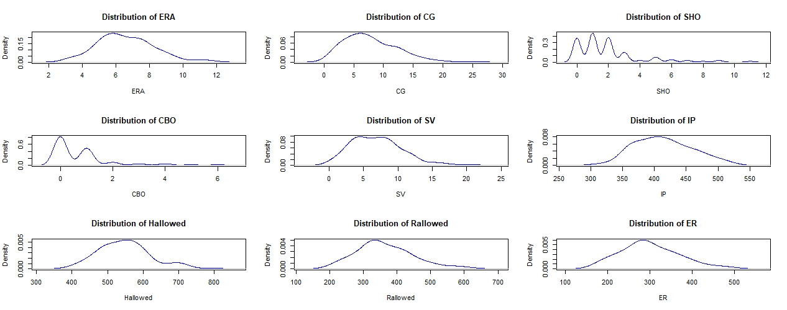

Given the relative normality of the data, I thought a good place to get a baseline idea of some variable importance would be doing some correlation analysis. I did a correlation analysis for all the variables in three broad categories of batting, fielding, and pitching, and then visalized the top three from each cateogry. These visualizations can be seen below. 

### Top 3 Batting Correlations
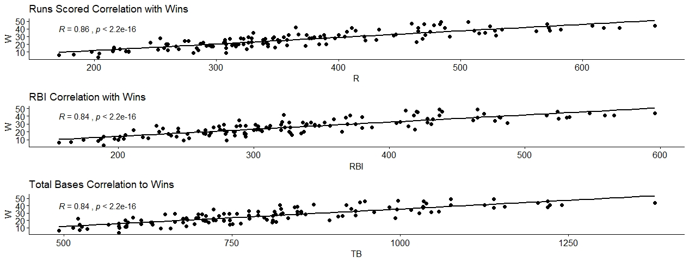

### Top 3 Fielding Correlations
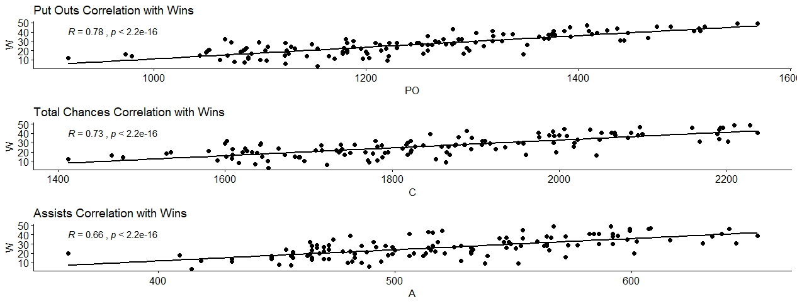

### Top 3 Pitching Correlations
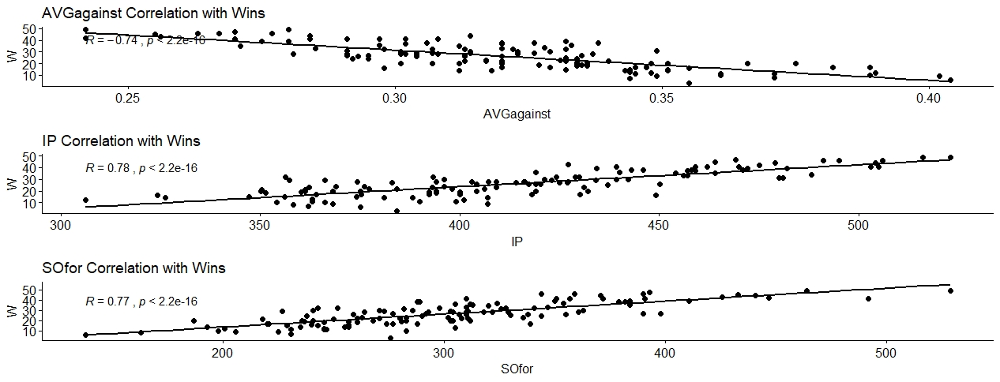

Based on the tables and graphs, it can be seen that for batting, Runs Scored (R), Runs Batted In (RBI), and Hits (H) have strong positive correlations with wins. For fielding, Putouts (PO), Chances (C), and Assists (A) are positively correlated with wins. Lastly, for pitching, Innings Pitched (IP), and Strikeouts thrown (SOfor) have positive correlations with wins while Earned Run Average (ERA) has a strong negative correlation. It can also be seen that quite a few of the variables in the batting category exhibit strong positive correlations with wins. Additionally, the top three variables in the batting category have the highest R values. This is an interesting observation that I will keep in mind as I move into creating a random forest and determining variable importance. 

## Random Forest 

I have chosen to use a random forest in order to predict RMAC winners, and determine variables importance. The advantage to using Random Forest is that the algorithm decorrelates trees which in turn decreases variance and boosts accuracy. The results of the random forest and the variable importance can be seen below.

Call:
 
        randomForest(formula = W ~ ., data = Train, importance = TRUE) 
               Type of random forest: regression
                     Number of trees: 500
       No. of variables tried at each split: 17

          Mean of squared residuals: 9.984276
                    % Var explained: 91.97

### Variable Importance Plot
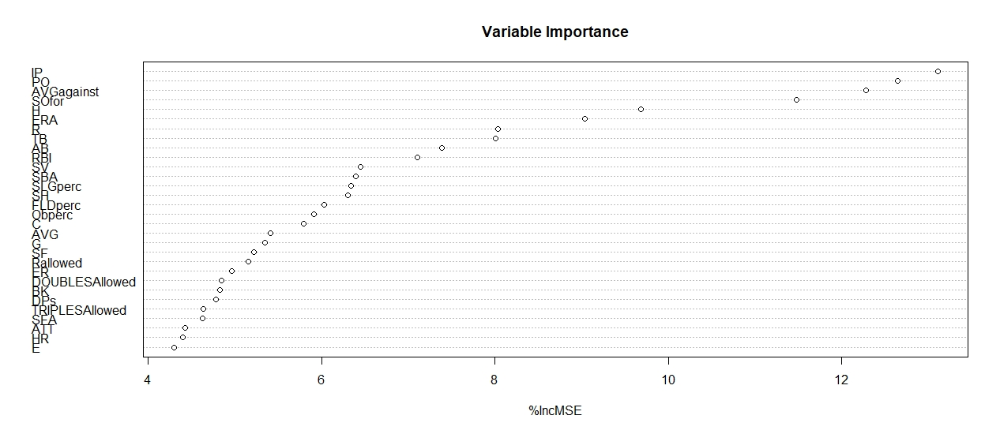

Based on the random forest, the top 10 most important variables for winning baseball games are as follows:
       
       1.	Innings Pitched
       2.	Putouts
       3.	Batting Average Against
       4.	Strikeouts for pitching staff
       5.	Hits
       6.	Earned Run Average
       7.	Runs Scored
       8.	Total Bases
       9.	At-bats
       10.	Run Batted In

## Analysis 

The following pictures are of an excel file containing the top 10 statistics as determined by the random forest for each team in each year. I have created average measures for the batting statistics and for two of the pitching statistics. I did not average the number of innings pitched nor did I average the number of putouts for each team. This is because the higher the number of innings pitched the better, but for the other two pitching stats, the lower the numbers the better. Putouts is also the only pure fielding statistic in the list, and it does not make sense to average a fielding stat with batting or pitching stats. If the random forest is right and these are the most important variables in determing wins, then the team with the highest average of batting stats(hits, runs scored, total bases, at-bats, and runs batted in),highest number of innings pitched, highest number of putouts, and lowest average of AVGagaisnt and ERA should have the most number of wins. I have color coded all these numbers to help visualize the best and worst numbers more eaisly. Cells that are entirely red to the right of the averaged numbers represent outliers. 

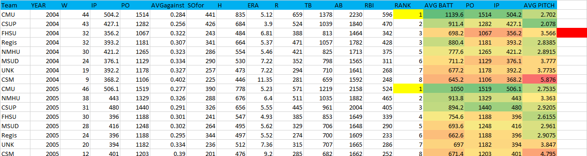
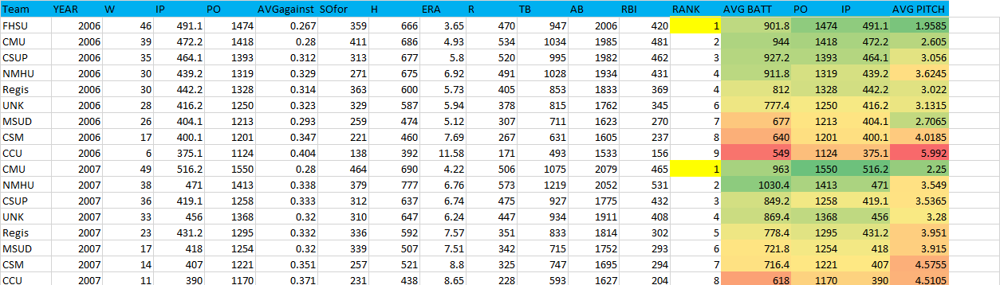
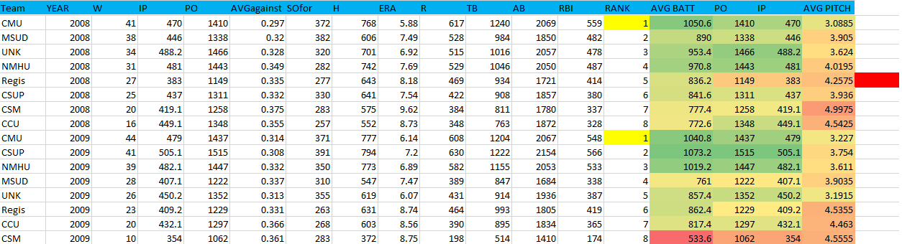

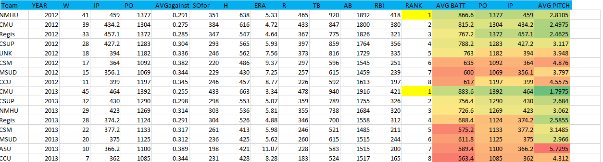
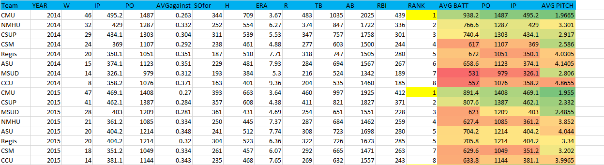
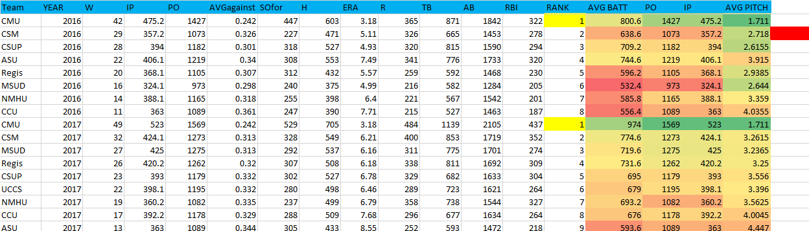
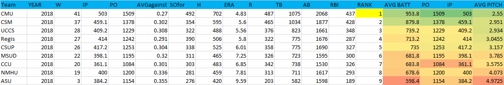

As far as winners are concerned, the only year that was incorrectly predicted by the random forest was 2010. New Mexico Highlands University (NMHU) won the most number of games that year, but the random forest predicted that Colorado Mesa University (CMU) would win more. Examing this data more in-depth, it can be seen that New Mexico Highlands had worse numbers than Colorado Mesa in all of the top 10 most important statistical categories except AVGagainst and ERA for which they had better numbers. Natrually, the random forest predicted that the team with the higher number of better statistics would win more games. However, while Colorado Mesa may have had a better year hitting than New Mexico Highlands, they did not pitch as well, and this is what led to Colorado Mesa winning fewer games than what the random forest predicted. Thus, based on this case, it is safe to say that pitching plays a very important role in winning games in the RMAC, however, more on this in the next section.

## Conclusion/Insights

Based on the findings from the excel tables above, I conclude that the variable importance as determined by the random forest is currently an accurate representaion of the statistical categories most important when it comes to winning games in the RMAC.

At first thought, Innings Pitched (the top variable) does not seems as though it should have a large effect on wins. It is not a performance measure and to many may simply seem like a statistic that is recorded just to help with the calculation of other statistics. However, upon deeper analysis, it can be inferred that the more innings a team pitches, the more games the team is winning on the road. The only way that a visiting team would have to pitch the bottom of the 9th or 7th inning would be if the visiting team was ahead of the home team in the final inning of play, or the game was tied in the final inning of play. Either way, a team that wins on the road will have more innings pitched than a team that loses on the road. If roughly half the games a team plays during the season are road games, this means a significant portion of wins must come on the road. 

Coming in at number two is Putouts. Putouts can be thought of in a similar way to innings pitched. Every out in a baseball game is recorded as a putout and someone is credited with the putout. Therefore, the only way for one team to have more putouts than another team if they are playing more innings on the road. If a team is not winning a game on the road after the top of the 9th or 7th inning there will be no bottom of the 9th or 7th, and therefore no opportunity for that team to record three more putouts. Thus, a higher number of putouts indicates more innings played which indicates a higher likelihood that games on the road result in wins. Just as it is important to have pitchers that can throw a lot of innings, it is equally as important to have position players capable of playing everyday. 

The next two most important variables (numbers 3 and 4) are pithcing staistics. These are Batting Average Against and Strikouts recorded by the pitching staff respectively. The faxt that three of the top four most important variables are pitching statistics reinforces the point that pitching is a key factor in winning games. A low batting avergae against means that opposing hitters are not getting on base. A high number of strikeouts for the pitching staff also means that opposing hitters are not even putting the ball in play which all but elimintes any opportunity for the opposing team to score runs. All this being said, there is one caveat to batting average against being thought of as purely a pitching statistic though. The factor that this particular statistic does not directly measure is the solid defensive play behind the pitcher that turns what could be potential hits for the opposing team into outs. Outstanding defensive plays that rob the opposing team of a hit help lower the batting average aginst for pitchers. However, if a pitcher consistently limits the number of balls the opposing team hits hard, many of the plays that a defense has to make may be thought of as "routine". In any the importance of a low average against implies the need for a defense capable of at least making all the "routine" plays on a consistent basis, and a pitcher that can throw strikeouts. 

Hits is the next most important variable and the first that is offensive. This means that first and foremost hitters need to get hits. Hits means base runners, and getting more hits with runners on base means scoring runs. 

Coming in at number 6 is Earned Run Average. This is another pitching statistic and the lower the ERA of the pitching staff the better. A low ERA will be the result of pitching a lot of innings while limiting the number of hits the other teams gets (low batting average against), and throwing a high number of strikeouts. 

The last four variables in the top 10 (numbers 7-10) are all offensive and are all intuitively important. The more runs the team scores, the better. Scoring more runs that the other team means winning the game. In order to score runs, hitters need to get on base, and then more hiters need to get more hits to score those runs (reinforcing the importance of Hits). Of course it helps when pitching can limit the number of runs the other team scores as well. Scoring runs also means that hitters are touching more bases, increasing the total bases measure for the team. For every run that is scored, total bases is equal to four. Hitter will get more total bases by getting hits or drawing walks (either outcome is a quality at-bat) and then running the bases well. As for at-bats, more hits leads to more at-bats which in turn leads to the opportunity to drive in more runs and boost RBI numbers. 

The next four variables (numbers 5-8) are offensive variables. They are hits (H), runs scored (R), runs batted in (RBI), and at bats (AB). While pitching is clearly an important factor in winning games, the only way a team can win a game is to score more runs than the other team which comes from the offense. The more hits a team gets, the more runners it will have on base. The more runners on base, the more opportunities there are to score runs through good base running and more timely hitting. At-bats is a similar measure to innings pitched in that it may seem as though it is a statistic that is recorded just to help in the calculation of other statistics. However, similar to innings pitched, the more at-bats a team has, the more times that team is going through their lineup while hitting which means more hitters are reaching base safely. The more hitters that reach base safely, the more opportunities there are to score runs. 

## Recomendations for the coaches

Pitching: The necessity of pitching more innings to win games indicates that is important for a team to have a pitching staff with starters that can pitch deep into games, a bullpen comprised of arms capable of pitching in multiple games during a series, a starting rotation/bullpen that has a good amount of depth, or all the above. Recruiting pitchers that are projectable when it comes to throwing a lot of innings, and implimenting training regiments designed to preserve and strenghten the throwing arm of pitchers becomes a crucial element for a team to win games in the RMAC. Pitchers that can limit the number of hits the opposing team can get by either generating weak contact and/or throwing a high number of strikeouts is also an importanct component within the pitching staff. 

Hitting/Fielding: First and foremost hitters need to get hits. This means having hitters that can hit for average and get on base. Ideally these hitters will have a bit of speed to them as well leading them to increase the total number of bases they are able to touch,  and increasing their odds of scoring on subsequent hits once they are on base. This being said, another component of total bases is having some guys that can drive the ball and hit stand up doubles and home runs. Power in the line-up will also boost RBI numbers. Lastly in terms of hitting, the bottom of the line-up being able to “turn over” the lineup and get the top of the order back up will boost the number of at-bats the team will get which is another important factor in winning games. This also implies that finding good hitters is an important piece when it comes to recruiting players. So much so, that it may be better to recruit naturally good hitters that may not be as good at fielding, and then train them to become better hitters once they are at school.  This being said, it would be interesting to conduct a study purely dedicated to position players that divides data based on offensive and defensive statistics. This might give a coaching staff a better idea of which positions need to be solid defenders (which may come at the expense of good offensive numbers), and which positions need to be better hitters which may come at the expense of better defense. 

## References

https://www.r-bloggers.com/how-to-implement-random-forests-in-r/

https://datascienceplus.com/random-forests-in-r/

James, G., Witten, D., Hastie, T., & Tibshirani, R. (2015). An Introduction to Statistical Learning: With applications in R (7th ed.). New York: Springer. 

https://www.statmethods.net/advgraphs/layout.html

https://www.rdocumentation.org/packages/ggpubr/versions/0.2/topics/ggscatter

https://www.rdocumentation.org/packages/ggpubr/versions/0.2/topics/ggarrange

https://datascienceplus.com/imputing-missing-data-with-r-mice-package/

https://statistical-programming.com/predictive-mean-matching-imputation-method/
